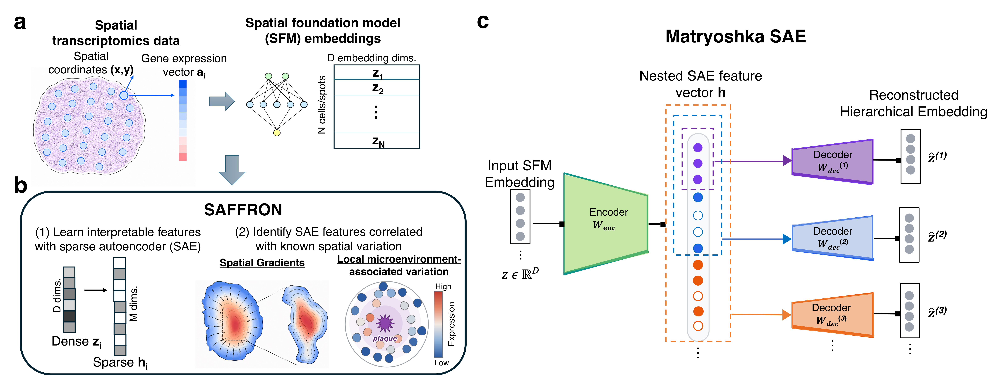

SAFFRON — Sparse Autoencoder Framework For Representing Omics Natural variation
================================================================================

SAFFRON is a mechanistic interpretability framework for evaluating whether spatial
transcriptomics foundation model (SFM) embeddings capture known sources of spatial
variation in gene expression, using a Matryoshka sparse autoencoder (SAE) to
decompose embeddings into sparse, human-interpretable features.

Given (1) a set of embeddings ``Z`` (from an SFM, a single-cell FM, or even raw gene
expression) and (2) a known measure of spatial variation ``τ`` for the same cells,
SAFFRON trains a sparse autoencoder on ``Z`` and evaluates which of its learned
features track ``τ`` — by per-feature correlation, and by finding a minimal
reconstructing subset with orthogonal matching pursuit (OMP).

Getting started with SAFFRON
-----------------------------
- Browse :doc:`notebooks/tutorials/index` for two worked examples: a **global**
  spatial gradient, and **local** microenvironment measures.
- See :doc:`installation` to install.
- See :doc:`api` for the full API reference.
- Discuss usage and issues on `github <https://github.com/chitra-lab/SAFFRON>`_.

.. toctree::
    :caption: General
    :maxdepth: 2
    :hidden:

    installation
    api

.. toctree::
    :caption: Tutorials
    :maxdepth: 2
    :hidden:

    notebooks/tutorials/index
